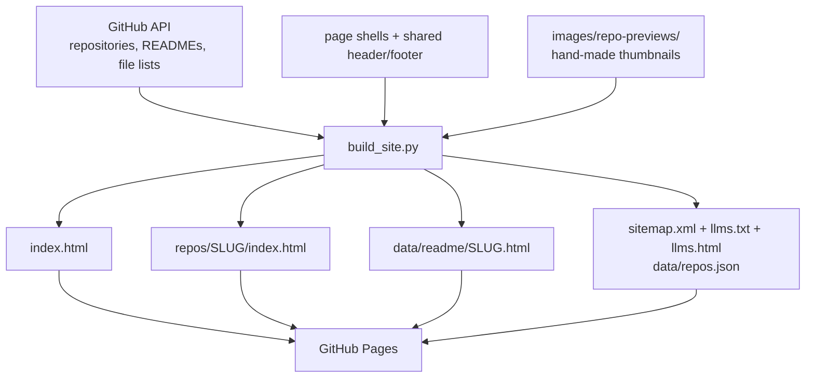

<!--
This file is part of Eisenberg Family Depression Center Open Source Hub
Copyright © 2026 The Regents of the University of Michigan
Licensed under the GNU Free Documentation License v1.3 or later.
See <https://www.gnu.org/licenses/fdl-1.3.html>. See README for full license information.
-->

# Eisenberg Family Depression Center: Open Source Projects

## Architecture

[Back to the project README](../README.md)

This page explains how the Open Source Hub website is put together. The short version: a
Python script reads the organization's public repositories from GitHub once a night and writes
finished HTML files into this repository. GitHub Pages then serves those files. Nothing is
assembled in the visitor's browser.

## Why the site is built ahead of time

The site used to build itself in the browser. Every visit called the GitHub API, then drew the
repository cards with JavaScript. That created three problems:

1. **Search engines saw an empty page.** A crawler that does not run JavaScript received three
   loading spinners and no repository names, descriptions, or README text.
2. **Every visitor spent part of a shared budget.** Anonymous calls to the GitHub API are
   limited to 60 an hour per address, so a busy moment could leave the page blank.
3. **Nothing appeared until two network round trips finished.**

Building ahead of time fixes all three. The trade-off is that content can be up to a day old,
which is fine for a catalog of repositories.

## The parts

| Part | What it does |
| --- | --- |
| `scripts/build_site.py` | Reads GitHub and writes the whole site. The only program that produces pages. |
| `scripts/imagelib.py` | Crops and resizes preview images. Shared with the two manual resize scripts. |
| `scripts/resources.py` | The Center's public resources and their categories. Edit this to change the landing page, `llms.html`, and `llms.txt` resource lists. |
| `templates/index.html` | The landing page shell, with placeholder tokens the build fills in. |
| `templates/repo.html` | The shell for one repository's page. |
| `templates/llms.html` | The shell for the human-readable site index. |
| `templates/header.html` | The shared header inserted into every page shell at build time. |
| `templates/footer.html` | The shared footer inserted into every page shell at build time. |
| `styles/site.css` | All styling, shared by the landing page and every repository page. |
| `scripts/site.js` | Search, tag filtering, and the slide-in panel. Every feature is optional. |
| `.github/workflows/build-site.yml` | Runs the build nightly, on pushes to `main`, and on request. Uses no actions at all, so it runs whatever the enterprise's action policy happens to allow. |

Files the build produces are marked in the repository as generated. Do not edit them by hand;
the next build overwrites them. Edit the templates, the stylesheet, or the script instead.

## How a page gets made

Described in words: the build script takes three inputs, which are the GitHub API, the page
templates, and the hand-made thumbnails stored in this repository. It inserts the shared
header and footer into each page shell before it fills the page-specific values. It then
produces the landing page, one page per repository, one panel fragment per repository, the
human-readable site index, and the machine-readable files. GitHub Pages serves all of it.

## Two views of the same content

Each repository appears twice, and both come from the same rendered README, so they cannot
disagree:

- **A page** at `/repos/<name>/`. This is what a search engine indexes and what a visitor
  without JavaScript sees.
- **A panel** on the landing page. Clicking a card loads `data/readme/<name>.html` and slides
  it in, which is faster than loading a whole page.

The card title is a real link to the page. The script intercepts an ordinary click and opens
the panel instead, but leaves Ctrl-click, middle-click, and "open in new tab" alone.

## Why detail pages live under `/repos/`

This repository is the organization's user site, so it owns the root of
`code.depressioncenter.org`. Other repositories that turn on GitHub Pages are served
underneath it by their own names, for example `code.depressioncenter.org/EMA-CleanR/`.

That means the first part of a path is not ours to use. A page written to `/EMA-CleanR/` would
be hidden by that repository's own site. GitHub matches only the **first** path segment against
a repository name, so `/repos/EMA-CleanR/` is safe: no repository is named `repos`.

The build checks this. If a repository named `repos` ever appears, the build stops and tells
you to change `DETAIL_PATH_PREFIX` rather than publishing pages nobody could reach.

## Design decisions worth knowing

- **GitHub renders the Markdown, not this site.** The build asks the API for the README as
  HTML. That keeps the formatting identical to GitHub, resolves relative image paths
  automatically, and removes the need for a Markdown library.
- **The README is sanitized anyway.** GitHub already strips dangerous markup, but content
  fetched at build time is treated as untrusted regardless of who rendered it.
- **The site describes itself to machines as well as people.** Alongside the sitemap and the
  JSON catalog, the build writes `llms.txt`, following the
  [llmstxt.org](https://llmstxt.org/) convention. It lists every repository with its source,
  documentation, and demo links, and tells an agent that this site is one part of a wider set
  of Eisenberg Family Depression Center resources rather than a standalone code index.
  The build also writes `llms.html` as an accessible site index for people. The two files link
  to each other and come from the same records, so they cannot drift.
- **Header and footer are build-time partials.** Each page shell contains one header token and
  one footer token. The build inserts `templates/header.html` and `templates/footer.html`
  before rendering the final page. Relative image and home paths come from the page depth.
- **The Center's other resources are listed once, in code.** `scripts/resources.py` holds
  them, and the build renders that one list into the landing page, `llms.html`, and `llms.txt`.
  Add an entry in any order; each category is sorted by name when rendered, and an unknown
  category stops the build rather than quietly dropping the entry. Each resource carries a
  short `summary` and a fuller `description`. Neither is hidden behind a hover, because touch
  and keyboard users cannot reach content revealed only on hover.
- **There is no fallback repository list.** The old page carried a hand-written copy of the
  repository data that slowly drifted out of date. The fallback now is simply the last
  successful build, which stays published if a build fails.
- **Two dependencies, no framework.** `Pillow` resizes images and `nh3` sanitizes HTML.
  There is no Node.js, no bundler, and no static site generator.

## Conclusion

You now know which files are written by hand, which are generated, and why the site is built
on a schedule. To change how a page looks, edit a template or the stylesheet. To change what
appears on it, edit `scripts/build_site.py`.

## Additional resources

+ [Data flow](data-flow.md)
+ [How to run the build locally](how-to/run-the-build-locally.md)
+ [Compliance](compliance.md)
+ [GitHub REST API documentation](https://docs.github.com/rest)
+ [GitHub Pages documentation](https://docs.github.com/pages)

[Back to the project README](../README.md)
